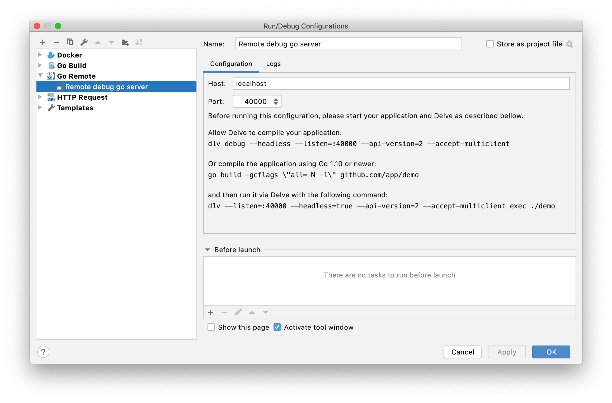
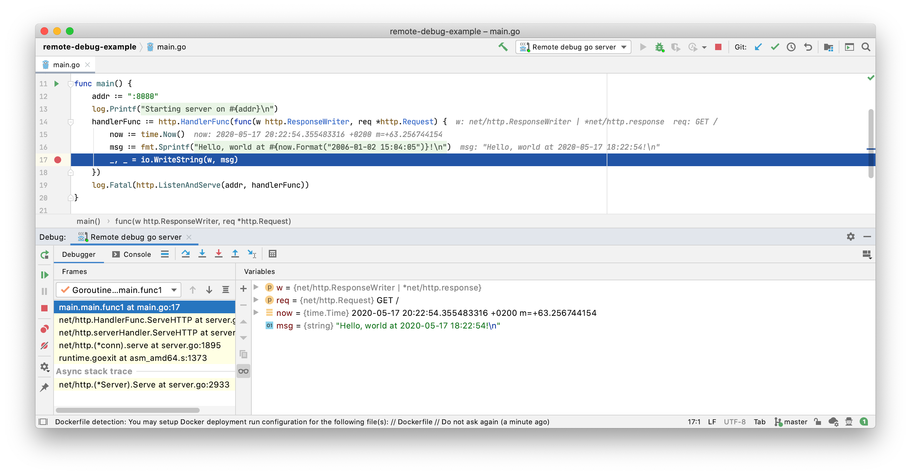

# remote-debug-example

Example to illustrate my [_Remote Debug with Go_][post] blogpost.

The project contains a simple go http server in `main.go`.

The server responds with `Hello, world at <current-time>!` to any http request.

## Build and run

It contains to `Dockerfile`s:
- `Dockerfile` builds the app and creates an image which can be used to run it.
- `Dockerfile.debug` is the same, but also contains [_delve_][delve] -- a debugger for Go. Additionally, it opens `:40000` to connect the remote debugger.

We have a docker compose spec to show how to start the containers:
```sh
$ docker-compose up
...
example_1               | 2020/05/17 17:57:36 Starting server on :8080
example-remote-debug_1  | API server listening at: [::]:40000
```

The _regular_ app starts right away on `:8080`:
```sh 
$ curl localhost:8080
Hello, world at 2020-05-17 18:02:49!
```

The _remote debug_ version doesn't start right away:
```sh
$ curl localhost:8081
curl: (52) Empty reply from server
```

## Connect with the remote debugger

You need to connect to the app with the debugger before it starts. This is to give you possibility to debug the initialization of the app. 



One you've connected you can interact with the app as usual:
```sh
$ curl localhost:8081
Hello, world at 2020-05-17 18:11:20!
```

You can also add breakpoints, and run the app step-by-step.




The screenshots are from Intellij Ultimate with go plugin, but the remote debugger can work with vscode (see [Debugging-Go-code-using-VS-Code.md#remote-debugging][remote-debug-vscode]) and possibly other editors as well.


## How does the remote debug work exactly?

* In contrast with the JVM world, the remote debug is not built-in. We need to use [_delve_][delve] -- a debugger for go.

* Instead of the binary, we start devle and tell it to run the binary.

* It can run in a headless mode where it waits for remote connections:
```
dlv --listen=:40000 --headless=true --api-version=2 --accept-multiclient exec app
```

* If we list processes in the _remote debug container_ we see both delve and the app:
```
root@257cd949c4c1:/# ps aux
USER       PID %CPU %MEM    VSZ   RSS TTY      STAT START   TIME COMMAND
root         1  0.1  1.5 1383152 30964 ?       Ssl  18:21   0:00 /dlv --listen=:40000 --headless=true --api-version=2 --accept-multiclient exec /app
root        10  0.0  0.2 1005372 5768 ?        tl   18:21   0:00 /app
```

* Delve needs to _fork-and-exec_ to run the binary, therefore we explicitly need to allow the `SYS_PTRACE` capability. 

[post]: https://kupczynski.info
[remote-debug-vscode]: https://github.com/microsoft/vscode-go/blob/master/docs/Debugging-Go-code-using-VS-Code.md#remote-debugging
[delve]: https://github.com/go-delve/delve